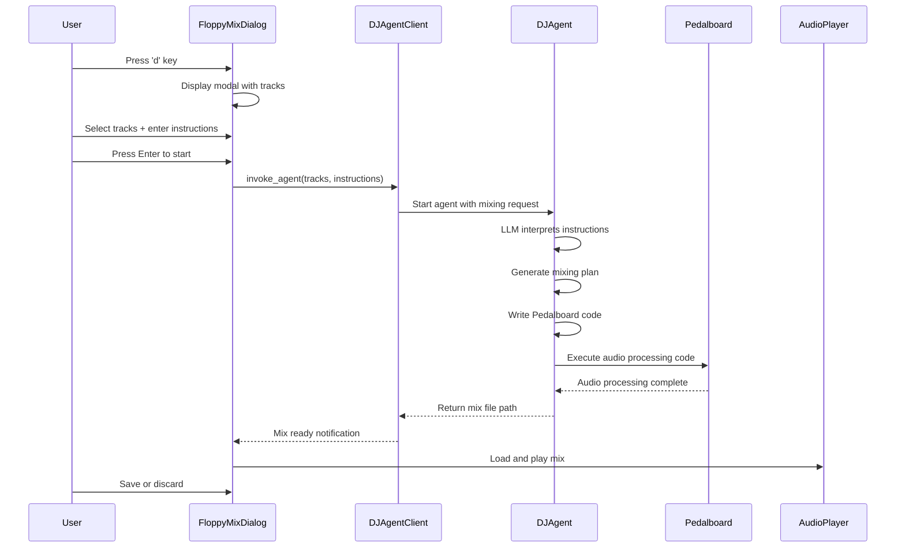

# Floppy Mix Design Document

## Overview

The Floppy Mix feature integrates autonomous agent-driven audio mixing capabilities into SIGPLAY. Users press 'd' to open a dialog where they select tracks and write mixing instructions in plain English (e.g., "more bass, 180 bpm rhythm with gapless play"). When they press Enter, SIGPLAY invokes a **Strands Agents agent** - a separate AI agent process that autonomously handles the mixing.

The Strands Agents agent workflow:
1. Receives the mixing request with selected tracks and user instructions
2. Interprets the natural language instructions using LLM capabilities (AWS Bedrock)
3. Generates a structured mixing plan with specific audio processing operations
4. Writes and executes Python code using the Pedalboard library to apply the mixing plan
5. Creates the final mix file and returns the file path to SIGPLAY

The feature is implemented as a modal dialog overlay that doesn't interrupt current playback. Once a mix is generated, users can preview it immediately and choose to save or discard it.

## Architecture

### Component Structure

```
SIGPLAY Application:
SigplayApp (main.py)
└── FloppyMixDialog (widgets/floppy_mix_dialog.py) [NEW]
    ├── TrackSelectionPanel (widgets/track_selection_panel.py) [NEW]
    ├── InstructionsPanel (widgets/instructions_panel.py) [NEW]
    └── MixProgressPanel (widgets/mix_progress_panel.py) [NEW]

Services:
├── AudioPlayer (services/audio_player.py) [EXISTING]
├── MusicLibrary (services/music_library.py) [EXISTING]
└── DJAgentClient (services/dj_agent_client.py) [NEW]
    └── Invokes and communicates with Strands Agents DJ agent

Models:
├── Track (models/track.py) [EXISTING]
└── MixRequest (models/mix_request.py) [NEW]

Strands Agents DJ Agent (separate process):
├── dj_agent.py [NEW]
│   └── Strands Agent configured with:
│       - AWS Bedrock LLM (Claude)
│       - Python code execution tools
│       - File system access
│       - Pedalboard library access
└── Agent autonomously:
    - Interprets mixing instructions
    - Generates mixing plan
    - Writes and executes Pedalboard code
    - Returns mix file path
```

### Data Flow



## Components and Interfaces

### 1. FloppyMixDialog Widget

**Purpose**: Modal dialog container that orchestrates the mixing workflow.

**Responsibilities**:
- Display modal overlay when 'd' key is pressed
- Coordinate between TrackSelectionPanel, InstructionsPanel, and MixProgressPanel
- Handle keyboard navigation (Escape to close, Enter to start mixing)
- Manage dialog state (idle, mixing, previewing)
- Communicate with AIMixerService for mix creation

**Interface**:
```python
class FloppyMixDialog(Container):
    """Modal dialog for Floppy Mix interface."""
    
    # Reactive state
    is_visible: reactive[bool] = reactive(False)
    mixing_state: reactive[str] = reactive("idle")  # idle, mixing, previewing
    
    def show(self) -> None:
        """Display the dialog as modal overlay."""
        
    def hide(self) -> None:
        """Close the dialog and cleanup."""
        
    def on_key(self, event: events.Key) -> None:
        """Handle keyboard events (Escape, Enter)."""
        
    async def start_mixing(self) -> None:
        """Initiate the mixing process with selected tracks and instructions."""
        
    def on_mix_complete(self, mix_file_path: str) -> None:
        """Handle successful mix completion."""
        
    def on_mix_error(self, error: str) -> None:
        """Handle mixing errors."""
```

### 2. TrackSelectionPanel Widget

**Purpose**: Display library tracks with multi-select capability.

**Responsibilities**:
- Display all tracks from MusicLibrary
- Handle vim-style navigation (j/k keys)
- Toggle track selection with Space key
- Maintain list of selected tracks
- Display visual indicators for selected tracks

**Interface**:
```python
class TrackSelectionPanel(Container):
    """Left panel for track selection."""
    
    selected_tracks: reactive[list[Track]] = reactive([])
    
    def compose(self) -> ComposeResult:
        """Yield ListView with tracks."""
        
    def on_list_view_selected(self, event: ListView.Selected) -> None:
        """Handle track selection."""
        
    def toggle_track_selection(self, track: Track) -> None:
        """Add or remove track from selection."""
        
    def get_selected_tracks(self) -> list[Track]:
        """Return currently selected tracks."""
```

### 3. InstructionsPanel Widget

**Purpose**: Text input area for natural language mixing instructions.

**Responsibilities**:
- Display multi-line text input
- Show placeholder examples when empty
- Validate that instructions are not empty
- Provide instructions to parent dialog

**Interface**:
```python
class InstructionsPanel(Container):
    """Right panel for mixing instructions."""
    
    instructions: reactive[str] = reactive("")
    
    def compose(self) -> ComposeResult:
        """Yield TextArea widget."""
        
    def get_instructions(self) -> str:
        """Return current instructions text."""
        
    def clear(self) -> None:
        """Clear the text input."""
```

### 4. MixProgressPanel Widget

**Purpose**: Display mixing progress and status messages.

**Responsibilities**:
- Show current operation status
- Display progress indicator during mixing
- Show playback controls during preview
- Display save/discard buttons when mix is ready

**Interface**:
```python
class MixProgressPanel(Container):
    """Bottom panel for progress and controls."""
    
    status_message: reactive[str] = reactive("")
    show_controls: reactive[bool] = reactive(False)
    
    def update_status(self, message: str) -> None:
        """Update the status message."""
        
    def show_preview_controls(self) -> None:
        """Display save/discard buttons."""
        
    def hide_preview_controls(self) -> None:
        """Hide save/discard buttons."""
```

### 5. DJAgentClient

**Purpose**: Client service that invokes and communicates with the Strands Agents DJ agent.

**Responsibilities**:
- Start the DJ agent process with mixing request
- Stream progress updates from agent to UI
- Handle agent errors and timeouts
- Retrieve mix file path from agent
- Cleanup agent process

**Interface**:
```python
class DJAgentClient:
    """Client for invoking the Strands Agents DJ agent."""
    
    def __init__(self, agent_script_path: str):
        """Initialize with path to DJ agent script."""
        
    async def create_mix(
        self,
        tracks: list[Track],
        instructions: str,
        progress_callback: Callable[[str], None]
    ) -> str:
        """
        Invoke DJ agent to create a mix.
        
        Args:
            tracks: List of Track objects to mix
            instructions: Natural language mixing instructions
            progress_callback: Function to call with status updates
            
        Returns:
            Path to the generated mix file
            
        Raises:
            AgentError: If agent fails to start or execute
            AgentTimeout: If agent exceeds timeout (5 minutes)
            MixingError: If audio processing fails
        """
        
    def _prepare_agent_input(
        self,
        tracks: list[Track],
        instructions: str
    ) -> dict:
        """Prepare input data for agent."""
        
    async def _monitor_agent_progress(
        self,
        agent_process,
        progress_callback: Callable[[str], None]
    ) -> str:
        """Monitor agent execution and stream progress updates."""
```

### 6. DJ Agent (Strands Agents)

**Purpose**: Autonomous AI agent that interprets mixing instructions and generates mixes.

**Responsibilities**:
- Receive mixing request from SIGPLAY
- Interpret natural language instructions using LLM
- Generate structured mixing plan
- Write Python code to execute mixing with Pedalboard
- Execute the code and handle errors
- Return mix file path

**Implementation**:
```python
# dj_agent.py
from strands import Agent
from strands.models.bedrock import BedrockModel

# Configure agent with AWS Bedrock
dj_agent = Agent(
    model=BedrockModel(
        model_id="anthropic.claude-3-5-sonnet-20241022-v2:0",
        region="us-east-1"
    ),
    system_prompt="""You are an expert DJ and audio engineer. 
    You receive mixing requests with track information and user instructions.
    Your job is to:
    1. Interpret the user's mixing instructions
    2. Generate a detailed mixing plan
    3. Write Python code using Pedalboard to execute the mix
    4. Return the path to the generated mix file
    
    Available tools: Python execution, file system access, Pedalboard library
    """,
    tools=[python_executor, file_system],
    max_iterations=10
)

def handle_mix_request(tracks: list[dict], instructions: str) -> str:
    """
    Process a mixing request.
    
    Args:
        tracks: List of track dictionaries with path, title, artist, duration
        instructions: User's natural language mixing instructions
        
    Returns:
        Path to generated mix file
    """
    prompt = f"""
    Create a DJ mix with the following tracks:
    {json.dumps(tracks, indent=2)}
    
    User instructions: {instructions}
    
    Use Pedalboard to process the audio. Return the path to the final mix file.
    """
    
    result = dj_agent(prompt)
    return result.mix_file_path
```

## Data Models

### MixRequest

```python
from dataclasses import dataclass

@dataclass
class MixRequest:
    """Request sent to DJ agent for mix creation."""
    
    tracks: list[dict]  # List of track info: {path, title, artist, duration}
    instructions: str   # Natural language mixing instructions
    output_dir: str     # Directory for output mix file
```

## Correct
ness Properties

*A property is a characteristic or behavior that should hold true across all valid executions of a system—essentially, a formal statement about what the system should do. Properties serve as the bridge between human-readable specifications and machine-verifiable correctness guarantees.*

### Property 1: Dialog maintains playback state
*For any* playback state (playing, paused, stopped), opening the Mix Dialog should not change the current playback state.
**Validates: Requirements 1.2**

### Property 2: Track list completeness
*For any* music library state, when the Mix Dialog opens, the Track Selection Panel should display exactly the same tracks as are present in the Music Library Service.
**Validates: Requirements 2.1**

### Property 3: Navigation cursor movement
*For any* track list position, pressing 'j' should move the cursor down by one position (unless at the end), and pressing 'k' should move the cursor up by one position (unless at the start).
**Validates: Requirements 2.2**

### Property 4: Selection toggle idempotence
*For any* track, pressing Space twice should return the track to its original selection state (selected → unselected → selected, or unselected → selected → unselected).
**Validates: Requirements 2.3**

### Property 5: Selection state persistence
*For any* set of selected tracks, all tracks should maintain their selection state and display visual indicators until explicitly toggled or the dialog is reset.
**Validates: Requirements 2.4, 2.5**

### Property 6: Text input preservation
*For any* text entered in the Instructions Panel, the text should be preserved and retrievable exactly as entered, including newlines and special characters.
**Validates: Requirements 3.2, 3.4**

### Property 7: Mixing initiation preconditions
*For any* dialog state, the mixing process should only initiate when both conditions are met: at least one track is selected AND instructions are non-empty.
**Validates: Requirements 4.1**

### Property 8: UI lock during processing
*For any* mixing operation in progress, attempts to modify track selections or instructions should be prevented until the operation completes or fails.
**Validates: Requirements 4.3**

### Property 9: Agent request completeness
*For any* mixing request, the data sent to the DJ agent should include both the user instructions and complete track information (paths, titles, artists, durations).
**Validates: Requirements 5.1, 5.2**

### Property 10: Agent response validity
*For any* successful agent execution, the Floppy Mix agent should return a valid file path that points to a playable audio file.
**Validates: Requirements 5.3**

### Property 11: Audio file loading completeness
*For any* mixing plan, all tracks referenced in the plan should be successfully loaded before processing begins.
**Validates: Requirements 6.1**

### Property 12: Tempo adjustment pitch preservation
*For any* audio track and target BPM, after tempo adjustment, the pitch (fundamental frequency) should remain within 1% of the original pitch.
**Validates: Requirements 6.2**

### Property 13: Gapless transition property
*For any* two consecutive tracks in a mix with crossfade transition, the audio output should contain no silent gaps (samples with amplitude below noise floor) at the transition point.
**Validates: Requirements 6.4**

### Property 14: Mix file generation
*For any* completed mixing process, a valid audio file should be generated that is playable and contains audio data from all input tracks.
**Validates: Requirements 6.5**

### Property 15: Automatic preview playback
*For any* successfully generated mix file, the Audio Player Service should automatically load and begin playback without requiring user interaction.
**Validates: Requirements 7.1, 7.2**

### Property 16: Playback control responsiveness
*For any* mix preview in progress, pressing the Space key should toggle the playback state (playing ↔ paused) within 100ms.
**Validates: Requirements 7.4**

### Property 17: Dialog closure cleanup
*For any* mix preview in progress, closing the Mix Dialog should stop playback and, if the mix was not saved, delete the temporary mix file.
**Validates: Requirements 7.5, 9.4**

### Property 18: Save operation correctness
*For any* filename provided by the user, the mix file should be saved to the Music Library directory with exactly that filename, and the file should be readable and playable.
**Validates: Requirements 8.3**

### Property 19: Discard operation cleanup
*For any* temporary mix file, activating the "Discard Mix" button should stop playback, delete the file, and reset the dialog to its initial state with no selections or instructions.
**Validates: Requirements 9.2, 9.3**

### Property 20: Error logging and notification
*For any* error that occurs during the mixing process, the error should be both logged to the SIGPLAY log file with full details AND displayed to the user as a friendly notification with actionable guidance.
**Validates: Requirements 10.4, 10.5**

### Property 21: Status message accuracy
*For any* mixing operation phase (analyzing, processing, rendering), the displayed status message should accurately reflect the current operation being performed.
**Validates: Requirements 10.2**

## Error Handling

### Error Categories

1. **User Input Errors**
   - No tracks selected: Display notification "Please select at least one track to mix"
   - Empty instructions: Display notification "Please provide mixing instructions"
   - Invalid filename: Display notification "Invalid filename. Please use only alphanumeric characters and underscores"

2. **Agent Execution Errors**
   - Agent fails to start: Display notification "Cannot start DJ agent. Please check your Strands Agents installation"
   - Agent timeout (>5 minutes): Display notification "DJ agent timed out. Please try again with simpler instructions or fewer tracks"
   - Agent execution error: Display notification "DJ agent encountered an error: [error message]. Please try again"

3. **Audio Processing Errors**
   - File not found: Display notification "Cannot find audio file: [filename]. Please check your library"
   - Unsupported format: Display notification "Audio format not supported: [format]. Supported formats: MP3, WAV, OGG, FLAC"
   - Processing failure: Display notification "Audio processing failed: [reason]. Please try with different settings"
   - Insufficient memory: Display notification "Not enough memory to process mix. Try selecting fewer tracks"

4. **File System Errors**
   - Cannot write file: Display notification "Cannot save mix file. Please check disk space and permissions"
   - Cannot delete temp file: Log warning but don't notify user (non-critical)

### Error Recovery

- All errors should return the dialog to a usable state
- Temporary files should be cleaned up even if errors occur
- Agent process should be terminated if it hangs or errors
- Audio processing errors from agent should include the specific track that failed
- All errors should be logged with full stack traces to `~/.local/share/sigplay/sigplay.log`

## Testing Strategy

### Unit Testing

Unit tests will verify specific examples and edge cases:

**UI Component Tests:**
- Test that pressing 'd' key shows the dialog
- Test that pressing Escape key hides the dialog
- Test that empty track selection shows warning message
- Test that empty instructions show placeholder text
- Test specific status messages appear at correct times

**Service Integration Tests:**
- Test Floppy Mix agent invocation with mock agent
- Test agent client communication and progress streaming
- Test file save/delete operations with temp directory

**Error Handling Tests:**
- Test behavior when Floppy Mix agent fails to start
- Test behavior when agent times out
- Test behavior when audio file is missing
- Test cleanup when errors occur during agent execution

### Property-Based Testing

Property-based tests will verify universal properties across all inputs using the Hypothesis library for Python:

**Configuration:**
- Each property test should run a minimum of 100 iterations
- Use custom generators for Track, MixRequest, and audio data
- Tag each test with format: `# Feature: floppy-mix, Property {number}: {property_text}`

**Test Coverage:**
- Property 1: Generate random playback states, verify dialog doesn't change them
- Property 2: Generate random music libraries, verify all tracks appear in panel
- Property 3: Generate random cursor positions, verify j/k navigation correctness
- Property 4: Generate random tracks, verify double-space returns to original state
- Property 5: Generate random selection sets, verify all persist with indicators
- Property 6: Generate random text with special characters, verify preservation
- Property 7: Generate random combinations of selections/instructions, verify mixing only starts when both present
- Property 8: Generate random modification attempts during mixing, verify all blocked
- Property 9: Generate random mixing requests, verify agent input completeness
- Property 10: Generate random agent responses, verify file path validity
- Property 11: Generate random mixing plans, verify all tracks load
- Property 12: Generate random audio and BPM values, verify pitch preservation
- Property 13: Generate random track pairs, verify no silence gaps in crossfades
- Property 14: Generate random mixing operations, verify valid output file
- Property 15: Generate random mix completions, verify auto-playback
- Property 16: Generate random playback states, verify space key toggles within 100ms
- Property 17: Generate random preview states, verify cleanup on close
- Property 18: Generate random filenames, verify correct save location and playability
- Property 19: Generate random discard operations, verify complete cleanup
- Property 20: Generate random errors, verify both logging and notification
- Property 21: Generate random operation phases, verify status message accuracy

Each test should be tagged with: `# Feature: floppy-mix, Property {number}: {property_text}`

**Custom Generators:**
```python
# Example generator for Track objects
@st.composite
def track_generator(draw):
    return Track(
        path=draw(st.text(min_size=1)),
        title=draw(st.text(min_size=1)),
        artist=draw(st.one_of(st.none(), st.text())),
        duration=draw(st.floats(min_value=1.0, max_value=600.0))
    )

# Example generator for audio data
@st.composite
def audio_data_generator(draw):
    duration = draw(st.floats(min_value=1.0, max_value=10.0))
    sample_rate = 44100
    num_samples = int(duration * sample_rate)
    return np.random.randn(2, num_samples).astype(np.float32)
```

### Integration Testing

Integration tests will verify the complete workflow:

1. **End-to-end mix creation**: Select tracks → enter instructions → verify mix file created
2. **Preview workflow**: Create mix → verify auto-play → verify controls work
3. **Save workflow**: Create mix → save with filename → verify file in library
4. **Discard workflow**: Create mix → discard → verify cleanup
5. **Error recovery**: Trigger error → verify dialog returns to usable state

### Manual Testing Checklist

- Verify dialog appearance matches design mockups
- Test with various terminal sizes
- Verify keyboard navigation feels responsive
- Test with real music library (10+ tracks)
- Test with various instruction complexities
- Verify audio quality of generated mixes
- Test with different audio formats (MP3, WAV, OGG, FLAC)
- Verify error messages are clear and helpful

## Performance Considerations

### Mixing Performance

- Audio processing should be performed in a background thread to avoid blocking the UI
- Progress updates should be sent to UI thread via `call_from_thread()`
- Large audio files (>10MB) should be processed in chunks to manage memory
- Target: Complete mixing of 3 tracks in under 30 seconds on typical hardware

### UI Responsiveness

- Dialog should appear within 100ms of pressing 'd' key
- Track selection should respond to j/k/space within 50ms
- Status messages should update within 200ms of operation changes
- Preview playback should start within 500ms of mix completion

### Memory Management

- Temporary mix files should be stored in system temp directory
- Audio data should be released from memory after processing
- Maximum memory usage: 500MB for mixing 10 tracks
- Cleanup temp files on application exit even if dialog wasn't closed properly

## Security Considerations

### File System Access

- Validate all file paths to prevent directory traversal attacks
- Only allow saving to Music Library directory or subdirectories
- Sanitize filenames to remove dangerous characters
- Check available disk space before starting mix rendering

### Agent Communication

- Use subprocess isolation for agent execution
- Set timeout for agent execution (5 minutes maximum)
- Validate agent output before using file paths
- Don't expose sensitive system paths to agent

### Audio Processing

- Validate audio file formats before loading
- Set maximum file size limit (100MB per track)
- Limit total number of tracks in a mix (10 tracks maximum)
- Prevent resource exhaustion from malicious audio files

## Future Enhancements

### Phase 2 Features

- **Mix Templates**: Save and load mixing instruction templates
- **BPM Detection**: Automatically detect BPM of tracks
- **Waveform Visualization**: Show waveforms during preview
- **Advanced Effects**: Support for more Pedalboard effects (distortion, compression, etc.)
- **Batch Processing**: Create multiple mixes from a queue

### Phase 3 Features

- **AI Learning**: Learn user preferences over time
- **Collaborative Mixing**: Share mixes with other users
- **Cloud Storage**: Save mixes to cloud services
- **Mobile Companion**: Control mixing from mobile device

## Dependencies

### New Dependencies

```toml
[project.dependencies]
pedalboard = ">=0.9.0"  # Audio processing (used by DJ agent)
hypothesis = ">=6.0.0"  # Property-based testing
strands-agents = ">=0.1.0"  # Agent framework for DJ agent
```

### Existing Dependencies

- textual >= 6.5.0 (UI framework)
- miniaudio >= 1.61 (audio playback)
- numpy >= 1.26.0 (audio buffer processing)
- mutagen >= 1.47.0 (audio metadata)

### Agent Dependencies

- Strands Agents framework installed
- AWS credentials configured (AWS_ACCESS_KEY_ID, AWS_SECRET_ACCESS_KEY) for Bedrock access
- AWS Bedrock model access enabled for Claude (anthropic.claude-3-5-sonnet-20241022-v2:0)
- Python execution environment for agent

## Implementation Notes

### Textual Framework Patterns

- Use `ContentSwitcher` to toggle between idle/mixing/preview states
- Use `LoadingIndicator` for progress display during mixing
- Use `Input` widget for filename prompt
- Use `TextArea` widget for multi-line instructions
- All styling in `styles/app.tcss`, no inline styles

### DJ Agent System Prompt

```python
DJ_AGENT_SYSTEM_PROMPT = """You are an expert DJ and audio engineer with deep knowledge of music mixing and audio processing.

Your role is to create professional DJ mixes using Python and the Pedalboard library.

When you receive a mixing request, you should:
1. Analyze the user's instructions and understand their intent
2. Plan the mixing approach (tempo matching, EQ adjustments, transitions, effects)
3. Write Python code using Pedalboard to execute the mix
4. Handle errors gracefully and provide clear feedback

Available capabilities:
- Load audio files (MP3, WAV, OGG, FLAC)
- Adjust tempo/BPM without changing pitch
- Apply EQ (bass, mid, treble adjustments)
- Create crossfade transitions for gapless playback
- Apply effects: reverb, chorus, delay, phaser, compression
- Render final mix to WAV file

Best practices:
- Always normalize audio levels to prevent clipping
- Use appropriate crossfade durations (2-4 seconds typical)
- Match tempos when user requests specific BPM
- Boost bass frequencies by 2-4 dB when user requests "more bass"
- Create smooth transitions between tracks
- Save output to the specified directory with timestamp in filename

Return the full path to the generated mix file when complete.
"""
```

### Agent Invocation Example

```python
# Example of how SIGPLAY invokes the DJ agent
from services.dj_agent_client import DJAgentClient

client = DJAgentClient(agent_script_path="dj_agent.py")

tracks = [
    {"path": "/music/track1.mp3", "title": "Song 1", "artist": "Artist 1", "duration": 180.0},
    {"path": "/music/track2.mp3", "title": "Song 2", "artist": "Artist 2", "duration": 200.0}
]

instructions = "more bass in songs, all in 180 bpm rhythm with gapless play"

mix_file_path = await client.create_mix(
    tracks=tracks,
    instructions=instructions,
    progress_callback=lambda msg: print(f"Progress: {msg}")
)

print(f"Mix created: {mix_file_path}")
```

## Deployment Considerations

- Feature requires Strands Agents framework to be installed
- AWS credentials (access key + secret key) must be configured via environment variables or AWS config
- User must have AWS Bedrock access enabled for Claude models in their AWS account
- Show helpful message on first use if agent dependencies or AWS credentials are missing
- Include example mixing instructions in documentation
- Provide troubleshooting guide for common agent execution and AWS authentication issues
- DJ agent script should be included in SIGPLAY distribution

### AWS Bedrock Authentication

The DJ agent uses standard AWS authentication methods:
- Environment variables: `AWS_ACCESS_KEY_ID`, `AWS_SECRET_ACCESS_KEY`, `AWS_REGION`
- AWS credentials file: `~/.aws/credentials`
- IAM role (if running on EC2/ECS)

The agent requires permissions to invoke Bedrock models (specifically `bedrock:InvokeModel` for Claude).
